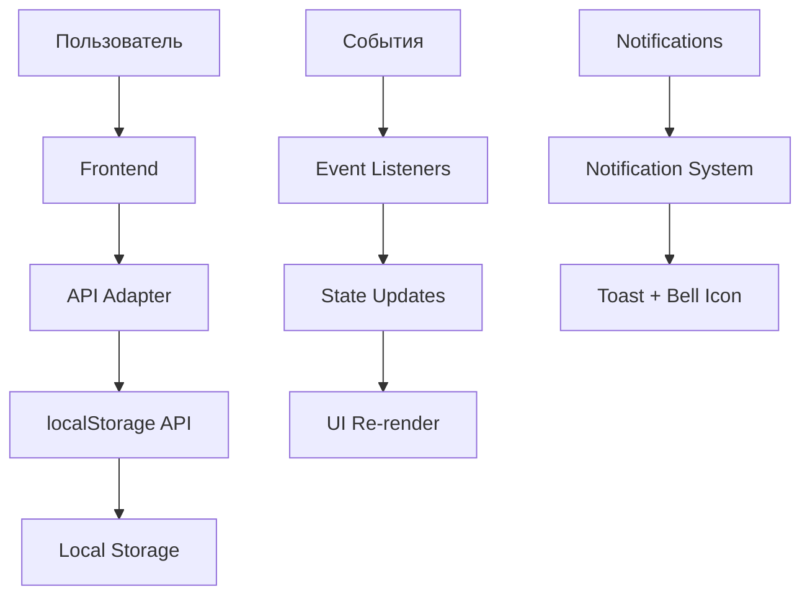

# Система купонов SolarGroup - Полная документация

## 📋 Содержание
1. [Обзор системы](#обзор-системы)
2. [Типы купонов](#типы-купонов)
3. [Сценарии использования](#сценарии-использования)
4. [Техническая реализация](#техническая-реализация)
5. [API Endpoints](#api-endpoints)
6. [Web Components](#web-components)
7. [База данных](#база-данных)
8. [UI/UX](#uiux)
9. [Развертывание](#развертывание)

---

## 🎯 Обзор системы

Система купонов SolarGroup позволяет пользователям получать скидки на инвестиционные пакеты. Система поддерживает различные типы купонов с разными условиями применения и сроками действия.

### Основные возможности:
- ✅ Купоны за регистрацию
- ✅ Купоны за пополнение баланса (100% бонус)
- ✅ Автоматическое создание купонов
- ✅ Система уведомлений
- ✅ Ограничение на один активный купон
- ✅ Модальное окно выбора проекта
- ✅ История использования купонов

---

## 🎫 Типы купонов

### 1. **Купон за регистрацию**
```javascript
{
    id: 1,
    code: 'WELCOME25',
    name: 'Добро пожаловать',
    description: 'Скидка для новых пользователей',
    discount_amount: 25,
    project_name: 'Все проекты',
    coupon_type: 'registration',
    auto_enabled: false,
    expires_at: '2025-12-31T23:59:59.000Z'
}
```

**Характеристики:**
- 💰 Сумма: $25
- 🎯 Применение: Все проекты
- ⏰ Срок действия: До 31 декабря 2025
- 🔄 Автоактивация: Нет
- 📱 Уведомление: Показывается при входе в систему

### 2. **Купон за пополнение**
```javascript
{
    id: Date.now(),
    code: 'DEPOSIT{amount}',
    name: '{amount}$ Бонус за пополнение',
    description: 'Получите бонус 100% от суммы пополнения',
    discount_amount: depositAmount, // 100% от суммы пополнения
    project_name: 'Все проекты',
    coupon_type: 'deposit',
    auto_enabled: true,
    expires_at: '2025-12-31T23:59:59.000Z' // 31 декабря текущего года
}
```

**Характеристики:**
- 💰 Сумма: 100% от суммы пополнения
- 🎯 Применение: Все проекты
- ⏰ Срок действия: До 31 декабря текущего года
- 🔄 Автоактивация: Да
- 📱 Уведомление: Показывается после пополнения

### 3. **Специальные купоны в истории**
```javascript
// Истекший купон
{
    id: 4,
    code: 'EXPIRED30',
    name: 'Истекший купон',
    status: 'expired',
    used: true
}

// Отозванный купон
{
    id: 5,
    code: 'REVOKED15',
    name: 'Отозванный купон',
    status: 'revoked',
    used: true
}
```

---

## 📖 Сценарии использования

### Сценарий 1: Купон $25 за регистрацию

#### Описание
Новый клиент, впервые входящий в систему, получает купон на $25. Этот купон предназначен для привлечения новых пользователей и может быть использован для инвестирования во все проекты.

#### Логика реализации
1. **Вход в систему**: При загрузке любой страницы система проверяет наличие купона с `coupon_type: 'registration'`
2. **Уведомление**: Если купон найден, показывается всплывающее уведомление: "У вас есть новый купон! Вам доступен купон на $25 за регистрацию"
3. **Переход на страницу купонов**: При клике на уведомление пользователь перенаправляется на `/coupons.html`
4. **Отображение купона**: Купон отображается как обычный активный купон, релевантный для "Всех проектов"
5. **Механика использования**: Стандартная механика применения и использования купона

#### Технические детали
- **Файлы**: `dashboard.js`, `wallet.js`, `coupons.js`, `deposit.js`
- **Функция**: `checkRegistrationCoupon()`
- **API**: `GET /api/coupons/active/1`
- **Компонент**: `notification-system`

### Сценарий 2: Купон за пополнение (Новогодний бонус)

#### Описание
Пользователь пополняет баланс на любую сумму и получает купон на 100% от суммы пополнения. Этот купон может быть использован для инвестирования во все проекты и автоматически активируется.

#### Логика реализации
1. **Баннер на главной странице**: Промо-карточка "Новогодний бонус" в горизонтальном карусели
2. **Страница акции**: `/newyear-bonus.html` с описанием акции и калькулятором
3. **Баннер на странице пополнения**: "Пополните баланс на любую сумму и получите 100% бонус"
4. **Пополнение баланса**: Пользователь вносит сумму на `/deposit.html`
5. **Создание купона**: Система автоматически создает купон с суммой, равной сумме пополнения
6. **Уведомление**: "Получен купон! Вам начислен купон на $X за пополнение"
7. **Отображение купона**: Новый купон отображается на всех страницах
8. **Автоматическое включение**: Купон автоматически активируется на странице оформления
9. **Использование купона**: После оплаты пакета купон помечается как использованный

#### Технические детали
- **Файлы**: `deposit.js`, `newyear-bonus.js`, `checkout.js`
- **Функции**: `createDepositCoupon()`, `addNotification()`
- **API**: `POST /api/coupons/create-deposit`, `POST /api/notifications`
- **Компоненты**: `notification-system`, `coupon-package`

### Сценарий 3: Использование купона "Все проекты" с модальным окном

#### Описание
При использовании купона, релевантного для "Всех проектов", показывается модальное окно с выбором конкретного проекта.

#### Логика реализации
1. **Клик "Использовать"**: Пользователь нажимает кнопку на купоне
2. **Проверка типа**: Система определяет, что купон для "Всех проектов"
3. **Модальное окно**: Показывается `project-selection-modal` с двумя проектами:
   - Дирижабли 🚁
   - Совэлмаш 🏭
4. **Выбор проекта**: Пользователь выбирает проект
5. **Переход**: Перенаправление на `/packages.html?project={selected}`

#### Технические детали
- **Событие**: `coupon-use-all-projects`
- **Компонент**: `project-selection-modal`
- **Файлы**: `wallet.js`, `coupons.js`

### Сценарий 4: Ограничение на один активный купон

#### Описание
На странице оформления пакета может быть активен только один купон одновременно.

#### Логика реализации
1. **Активация купона**: Пользователь включает купон
2. **Деактивация других**: Все остальные купоны автоматически деактивируются
3. **Обновление расчета**: Пересчитывается общая сумма с учетом активного купона
4. **Визуальная индикация**: Активный купон подсвечивается, неактивные затемняются

#### Технические детали
- **Файл**: `checkout.js`
- **Событие**: `coupon-toggle`
- **Функция**: `updateTotalWithCoupons()`

---

## ⚙️ Техническая реализация

### Архитектура системы

```
┌─────────────────┐    ┌─────────────────┐    ┌─────────────────┐
│   Frontend      │    │   API Layer     │    │   Data Layer    │
│                 │    │                 │    │                 │
│ • Web Components│◄──►│ • api-adapter.js│◄──►│ • localStorage  │
│ • Pages         │    │ • Routes        │    │ • JSON Storage  │
│ • JavaScript    │    │ • Validation    │    │ • Persistence   │
└─────────────────┘    └─────────────────┘    └─────────────────┘
```

### Основные компоненты

#### 1. **localStorage-api.js**
Центральный модуль для работы с данными:
- Инициализация данных
- CRUD операции с купонами
- Создание купонов за пополнение
- Управление уведомлениями

#### 2. **api-adapter.js**
Промежуточный слой API:
- Маршрутизация запросов
- Валидация данных
- Обработка ошибок

#### 3. **Web Components**
- `coupon-package.js` - Компонент купона на странице оформления
- `mini-coupon.js` - Мини-купон для кошелька
- `full-coupon-card.js` - Полная карточка купона
- `project-selection-modal.js` - Модальное окно выбора проекта
- `notification-system.js` - Система уведомлений

### Поток данных



---

## 🔌 API Endpoints

### Купоны

#### `GET /api/coupons/active/:userId`
Получение активных купонов пользователя
```javascript
Response: [
    {
        id: 1,
        code: 'WELCOME25',
        name: 'Добро пожаловать',
        discount_amount: 25,
        project_name: 'Все проекты',
        coupon_type: 'registration',
        expires_at: '2025-12-31T23:59:59.000Z'
    }
]
```

#### `GET /api/coupons/history/:userId`
Получение истории купонов
```javascript
Response: [
    {
        id: 2,
        name: 'Использованный купон',
        status: 'used',
        used_at: '2025-01-15T10:30:00.000Z'
    }
]
```

#### `POST /api/coupons/use`
Использование купона
```javascript
Request: {
    userId: 1,
    couponId: 1,
    packageId: 'sov-500'
}

Response: {
    success: true,
    message: 'Купон успешно использован'
}
```

#### `POST /api/coupons/create-deposit`
Создание купона за пополнение
```javascript
Request: {
    userId: 1,
    depositAmount: 1000
}

Response: {
    status: 200,
    data: {
        coupon: {
            id: 1234567890,
            name: '1000$ Бонус за пополнение',
            discount_amount: 1000,
            coupon_type: 'deposit',
            auto_enabled: true
        }
    }
}
```

### Уведомления

#### `POST /api/notifications`
Добавление уведомления
```javascript
Request: {
    userId: 1,
    notification: {
        title: 'Новый купон!',
        message: 'Вам доступен купон на $25',
        action_url: '/coupons.html'
    }
}

Response: {
    status: 200,
    data: { success: true }
}
```

#### `GET /api/notifications/:userId`
Получение уведомлений пользователя
```javascript
Response: [
    {
        id: 1,
        title: 'Новый купон!',
        message: 'Вам доступен купон на $25',
        action_url: '/coupons.html',
        created_at: '2025-01-15T10:30:00.000Z',
        read: false
    }
]
```

---

## 🧩 Web Components

### coupon-package.js
Компонент купона на странице оформления пакета.

**События:**
- `coupon-toggle` - Переключение активности купона
- `coupon-use` - Использование купона для конкретного проекта
- `coupon-use-all-projects` - Использование купона для всех проектов

**Методы:**
- `setActive(boolean)` - Установка активности
- `getCouponData()` - Получение данных купона

### mini-coupon.js
Мини-купон для отображения в кошельке.

**Особенности:**
- Компактный дизайн
- Автоматическое определение типа события
- Поддержка модального окна для "Всех проектов"

### full-coupon-card.js
Полная карточка купона для страницы купонов.

**Статусы:**
- `used` - Использован (с оверлеем)
- `expired` - Истек (с оверлеем)
- `revoked` - Отозван (с оверлеем)

### project-selection-modal.js
Модальное окно выбора проекта для купонов "Все проекты".

**Проекты:**
- Дирижабли 🚁
- Совэлмаш 🏭

### notification-system.js
Система уведомлений с интеграцией в заголовок.

**Функции:**
- `addNotification(notification)` - Добавление уведомления
- `showToastNotification(notification)` - Показ toast-уведомления
- `toggleNotificationsList()` - Переключение списка уведомлений

---

## 🗄️ База данных

### Структура данных

#### Купоны (coupons)
```javascript
{
    id: number,
    user_id: number,
    code: string,
    name: string,
    description: string,
    discount: number,
    discount_amount: number,
    discount_type: 'fixed' | 'percentage',
    discount_value: number,
    min_amount: number,
    max_amount: number,
    project_name: string,
    expires_at: string, // ISO date
    conditions: string,
    used: boolean,
    created_at: string, // ISO date
    updated_at: string, // ISO date
    // Дополнительные поля
    coupon_type: 'registration' | 'deposit',
    auto_enabled: boolean,
    created_reason: string,
    deposit_amount: number,
    bonus_amount: number,
    total_amount: number
}
```

#### Использованные купоны (used_coupons)
```javascript
{
    id: number,
    user_id: number,
    code: string,
    name: string,
    description: string,
    discount_amount: number,
    project_name: string,
    expires_at: string,
    used: true,
    used_at: string, // ISO date
    status: 'used' | 'expired' | 'revoked',
    created_at: string,
    updated_at: string
}
```

#### Уведомления (notifications)
```javascript
{
    id: number,
    user_id: number,
    title: string,
    message: string,
    action_url: string,
    created_at: string, // ISO date
    read: boolean
}
```

### Инициализация данных

При первом запуске система создает:
1. **Купон за регистрацию** (WELCOME25)
2. **Специальные купоны в истории** (EXPIRED30, REVOKED15)
3. **Пустые массивы** для уведомлений и инвестиций

---

## 🎨 UI/UX

### Дизайн-система

#### Цвета
- **Основной**: `#2563eb` (синий)
- **Успех**: `#10b981` (зеленый)
- **Ошибка**: `#ef4444` (красный)
- **Предупреждение**: `#f59e0b` (оранжевый)

#### Компоненты

##### Карточка купона
```css
.coupon-card {
    background: white;
    border-radius: var(--radius-lg);
    box-shadow: 0 4px 20px rgba(0, 0, 0, 0.08);
    transition: all 0.3s cubic-bezier(0.4, 0, 0.2, 1);
}

.coupon-card:hover {
    transform: translateY(-4px);
    box-shadow: 0 12px 40px rgba(0, 0, 0, 0.15);
}
```

##### Статусные оверлеи
```css
.coupon-overlay {
    position: absolute;
    top: 0;
    left: 0;
    right: 0;
    bottom: 0;
    background: rgba(0, 0, 0, 0.8);
    display: flex;
    align-items: center;
    justify-content: center;
    color: white;
    font-weight: bold;
    border-radius: var(--radius-lg);
}
```

##### Система уведомлений
```css
.notification-toast {
    position: fixed;
    top: 20px;
    right: 20px;
    background: white;
    border-radius: var(--radius-lg);
    box-shadow: 0 8px 32px rgba(0, 0, 0, 0.2);
    z-index: 1000;
    animation: slideIn 0.3s ease-out;
}
```

### Адаптивность

#### Мобильные устройства
- Горизонтальная прокрутка для промо-карточек
- Свайп-жесты для навигации
- Увеличенные области касания
- Оптимизированные размеры шрифтов

#### Планшеты
- Адаптивная сетка купонов
- Оптимальное использование пространства
- Поддержка touch-событий

#### Десктоп
- Полная функциональность
- Hover-эффекты
- Клавиатурная навигация

---

## 🚀 Развертывание

### Требования
- Node.js 14+
- Современный браузер с поддержкой Web Components
- Локальный сервер (для разработки)

### Установка
```bash
# Клонирование репозитория
git clone <repository-url>
cd sg

# Запуск локального сервера
python3 -m http.server 8002
# или
npx serve -s . -l 8002
```

### Структура файлов
```
sg/
├── components/
│   └── web-components/
│       ├── coupon-package.js
│       ├── mini-coupon.js
│       ├── full-coupon-card.js
│       ├── project-selection-modal.js
│       └── notification-system.js
├── api/
│   └── index.js
├── data/
│   └── coupons-data.js
├── localStorage-api.js
├── api-adapter.js
├── *.html (страницы)
├── *.js (логика страниц)
└── style.css
```

### Конфигурация

#### Настройка API
```javascript
// api-adapter.js
const API_BASE_URL = '/api';
const DEFAULT_USER_ID = 1;
```

#### Настройка уведомлений
```javascript
// notification-system.js
const NOTIFICATION_DURATION = 5000; // 5 секунд
const MAX_NOTIFICATIONS = 10;
```

### Мониторинг

#### Логирование
```javascript
console.log('Coupon created:', couponData);
console.log('Notification sent:', notification);
console.log('API call:', endpoint, data);
```

#### Отладка
- Открыть DevTools
- Проверить Console на ошибки
- Проверить Network для API-запросов
- Проверить Application > Local Storage

---

## 📝 Примечания

### Ограничения
1. **Один активный купон**: На странице оформления может быть активен только один купон
2. **Локальное хранение**: Данные хранятся в localStorage браузера
3. **Один пользователь**: Система настроена для пользователя с ID = 1

### Будущие улучшения
1. **Серверная база данных**: Замена localStorage на PostgreSQL/MySQL
2. **Множественные пользователи**: Поддержка нескольких пользователей
3. **Админ-панель**: Управление купонами через веб-интерфейс
4. **Аналитика**: Отслеживание использования купонов
5. **Email-уведомления**: Отправка уведомлений на email

### Безопасность
1. **Валидация данных**: Все входные данные проверяются
2. **Санитизация**: HTML-контент экранируется
3. **CORS**: Настроены правильные заголовки
4. **Rate Limiting**: Ограничение частоты запросов (планируется)

---

## 🔗 Связанные файлы

- `COUPON_LOGIC.md` - Детальная логика купонов
- `COUPON_SCENARIOS.md` - Сценарии использования
- `README.md` - Общая документация проекта

---

*Документация обновлена: 9 октября 2025*
*Версия системы: 1.0.0*

