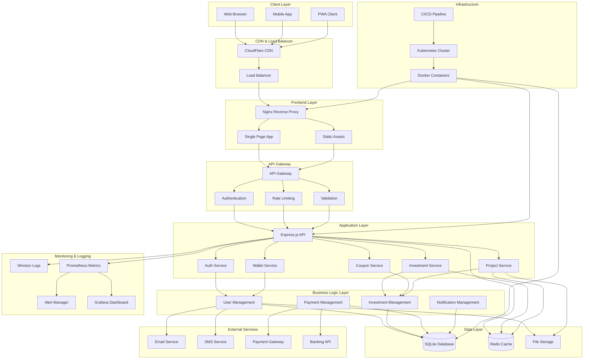

# SolarGroup Investment Platform - Architecture

## System Overview

The SolarGroup Investment Platform is a comprehensive web application that enables users to invest in renewable energy projects. The system is built with a modern, scalable architecture that supports high availability, security, and performance.

## Architecture Diagram

## Component Details

### Frontend Layer

- **Web Browser**: Modern browsers with ES6+ support
- **Mobile App**: React Native or Flutter application
- **PWA Client**: Progressive Web App with offline capabilities
- **CDN**: CloudFlare for global content delivery
- **Load Balancer**: Distributes traffic across multiple instances
- **Nginx**: Reverse proxy and static file server
- **Static Assets**: Optimized CSS, JS, and images
- **SPA**: Single Page Application with modern JavaScript

### API Gateway

- **Authentication**: JWT token validation and user session management
- **Rate Limiting**: Prevents abuse and ensures fair usage
- **Validation**: Input validation and sanitization
- **CORS**: Cross-Origin Resource Sharing configuration
- **Security Headers**: Helmet.js for security headers

### Application Layer

- **Express.js API**: RESTful API server
- **Auth Service**: User authentication and authorization
- **Wallet Service**: User wallet and balance management
- **Investment Service**: Investment operations and tracking
- **Coupon Service**: Promotional codes and discounts
- **Project Service**: Renewable energy project management

### Business Logic Layer

- **User Management**: User registration, profile, and preferences
- **Investment Management**: Investment calculations and tracking
- **Payment Management**: Payment processing and transactions
- **Notification Management**: Email, SMS, and in-app notifications

### Data Layer

- **SQLite Database**: Primary data storage with migrations
- **Redis Cache**: Session storage and performance caching
- **File Storage**: User uploads and project documents

### External Services

- **Email Service**: Transactional and marketing emails
- **SMS Service**: Two-factor authentication and notifications
- **Payment Gateway**: Credit card and bank transfer processing
- **Banking API**: Real-time balance and transaction data

### Monitoring & Logging

- **Winston Logs**: Structured logging with multiple transports
- **Prometheus Metrics**: Performance and business metrics
- **Alert Manager**: Automated alerting for critical issues
- **Grafana Dashboard**: Real-time monitoring and visualization

### Infrastructure

- **Kubernetes Cluster**: Container orchestration and scaling
- **Docker Containers**: Application containerization
- **CI/CD Pipeline**: Automated testing and deployment

## Data Flow

### User Registration Flow

1. User submits registration form
2. Frontend validates input client-side
3. API Gateway validates and sanitizes input
4. Auth Service checks for existing user
5. Email Service sends verification code
6. User Management creates user record
7. Wallet Service creates user wallet
8. Database stores user and wallet data
9. JWT token generated and returned
10. Frontend stores token and redirects user

### Investment Flow

1. User selects investment project
2. Frontend validates investment amount
3. API Gateway authenticates user
4. Investment Service validates investment
5. Wallet Service checks user balance
6. Payment Management processes payment
7. Investment Service creates investment record
8. Project Service updates project funding
9. Database stores investment data
10. Notification Service sends confirmation

### Payment Flow

1. User initiates deposit/withdrawal
2. Frontend collects payment details
3. API Gateway authenticates user
4. Payment Management validates payment
5. External Payment Gateway processes payment
6. Banking API verifies transaction
7. Wallet Service updates balance
8. Transaction Service records transaction
9. Database stores transaction data
10. Notification Service sends receipt

## Security Architecture

### Authentication & Authorization

- **JWT Tokens**: Stateless authentication with expiration
- **Password Hashing**: bcrypt with configurable rounds
- **Session Management**: Secure session handling
- **Role-Based Access**: User permissions and roles

### Data Protection

- **Input Validation**: Comprehensive input sanitization
- **SQL Injection Prevention**: Parameterized queries
- **XSS Protection**: Content Security Policy headers
- **CSRF Protection**: Cross-Site Request Forgery prevention

### Network Security

- **HTTPS**: TLS encryption for all communications
- **Rate Limiting**: API abuse prevention
- **CORS**: Controlled cross-origin access
- **Security Headers**: Helmet.js security middleware

### Monitoring & Auditing

- **Audit Logs**: User action tracking
- **Security Events**: Suspicious activity detection
- **Performance Monitoring**: Real-time system health
- **Alert System**: Automated incident response

## Scalability & Performance

### Horizontal Scaling

- **Load Balancing**: Multiple application instances
- **Database Sharding**: Data distribution across nodes
- **CDN**: Global content delivery
- **Caching**: Redis for performance optimization

### Vertical Scaling

- **Resource Optimization**: CPU and memory tuning
- **Database Optimization**: Query optimization and indexing
- **Asset Optimization**: Image and code minification
- **Lazy Loading**: On-demand resource loading

### Performance Monitoring

- **Response Time Tracking**: API performance metrics
- **Error Rate Monitoring**: System reliability metrics
- **Resource Usage**: CPU, memory, and disk monitoring
- **Business Metrics**: User engagement and conversion

## Deployment Architecture

### Development Environment

- **Local Development**: Docker Compose setup
- **Hot Reloading**: Development server with auto-restart
- **Database Seeding**: Test data for development
- **Mock Services**: External service simulation

### Staging Environment

- **Production-like Setup**: Similar to production
- **Integration Testing**: End-to-end testing
- **Performance Testing**: Load and stress testing
- **Security Testing**: Vulnerability scanning

### Production Environment

- **Kubernetes Cluster**: Container orchestration
- **High Availability**: Multi-zone deployment
- **Auto-scaling**: Dynamic resource allocation
- **Backup & Recovery**: Data protection and restoration

## Technology Stack

### Frontend

- **HTML5**: Semantic markup
- **CSS3**: Modern styling with custom properties
- **JavaScript ES6+**: Modern JavaScript features
- **Webpack**: Module bundling and optimization
- **PWA**: Progressive Web App capabilities

### Backend

- **Node.js**: JavaScript runtime
- **Express.js**: Web application framework
- **SQLite**: Embedded database
- **Redis**: In-memory data store
- **Winston**: Logging framework

### Infrastructure

- **Docker**: Containerization
- **Kubernetes**: Container orchestration
- **Nginx**: Web server and reverse proxy
- **Prometheus**: Metrics collection
- **Grafana**: Monitoring dashboard

### DevOps

- **GitHub Actions**: CI/CD pipeline
- **Docker Hub**: Container registry
- **Terraform**: Infrastructure as code
- **Helm**: Kubernetes package management

## Future Enhancements

### Planned Features

- **Microservices Architecture**: Service decomposition
- **Event-Driven Architecture**: Asynchronous processing
- **Machine Learning**: Investment recommendations
- **Blockchain Integration**: Smart contracts
- **Mobile App**: Native mobile application

### Scalability Improvements

- **Database Migration**: PostgreSQL or MySQL
- **Message Queue**: Redis or RabbitMQ
- **API Gateway**: Kong or AWS API Gateway
- **Service Mesh**: Istio for service communication
- **Multi-Region**: Global deployment

### Security Enhancements

- **OAuth 2.0**: Third-party authentication
- **2FA**: Two-factor authentication
- **Biometric Auth**: Fingerprint and face recognition
- **Zero Trust**: Network security model
- **Compliance**: GDPR and financial regulations

## Conclusion

The SolarGroup Investment Platform architecture is designed for scalability, security, and maintainability. The modular design allows for easy expansion and modification as the platform grows. The comprehensive monitoring and logging system ensures system reliability and performance optimization.

The technology stack is modern and well-suited for a financial application, with strong emphasis on security and user experience. The deployment architecture supports both development and production environments with proper CI/CD practices.
